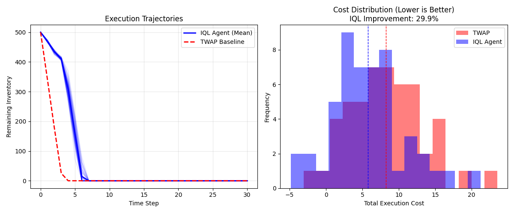

# Optimal Trade Execution with Constrained Offline RL


A research-grade framework for **Optimal Trade Execution** using **Implicit Q-Learning (IQL)** combined with **Lagrangian Primal-Dual constraints**. 

This system acts as an AI execution trader: it optimally liquidates a large inventory position over a fixed time horizon while strictly adhering to volume participation limits (to avoid excessive market impact).

---

## 🚀 Key Features

* **Offline Reinforcement Learning:** Utilizes **IQL** (Implicit Q-Learning) to learn stable trading policies from static datasets without the risks of online exploration in financial markets.
* **Safety Constraints (CMDP):** Implements a **Constrained Markov Decision Process** formulation. It uses Lagrangian relaxation to enforce strict participation rate limits ($p \le 5\%$).
* **Primal-Dual Optimization:** Dynamically adjusts penalty multipliers ($\lambda$) during training. If the agent trades too aggressively, the penalty increases, forcing the agent to find a safer strategy.
* **Almgren-Chriss Dynamics:** Built on a custom environment simulating linear permanent impact and temporary slippage.

---

## 📊 Performance Results

The agent was trained on synthetic market data and evaluated against a standard **Time-Weighted Average Price (TWAP)** baseline over 50 held-out episodes.

| Metric                      | IQL Agent | TWAP Baseline | Improvement |
| :---                        | :---      |  :---         | :---        |
| **Mean Execution Cost**     | **5.77**  | 8.24          | **+29.9%**  |
| **Constraint Satisfaction** | **Pass**  | Pass          | N/A         |

### Execution Trajectory
The plot below demonstrates the learned behavior. The **IQL Agent (Blue)** trades dynamically—front-loading execution when advantageous and slowing down to respect constraints—while TWAP (Red) trades linearly.



*(Note: Lower cost distribution indicates reduced slippage and better execution quality.)*

---

## 🛠️ Project Architecture

```text
optimal-execution-rl/
├── src/
│   ├── env_cmdp.py       # Almgren-Chriss Market Environment
│   ├── cmdp_env.py       # Lagrangian Wrapper for Constraint Handling
│   ├── iql.py            # Implicit Q-Learning Agent (Actor-Critic)
│   ├── trainer.py        # Primal-Dual Training Loop & BC Warm-start
│   └── dataset.py        # Replay Buffer for Offline Data
├── notebooks/
│   └── Master_Execution_Notebook.ipynb  # Interactive Demo & Analysis
├── results/
│   └── execution_results.png            # Performance Plots
├── run_all.py            # Main entry point for training
└── requirements.txt      # Dependencies
